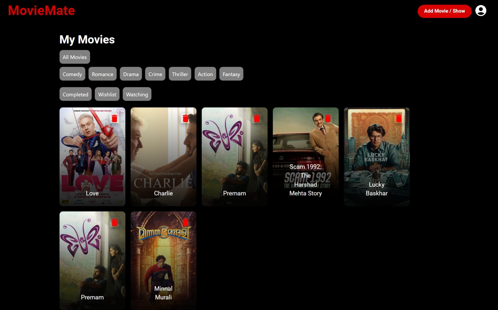
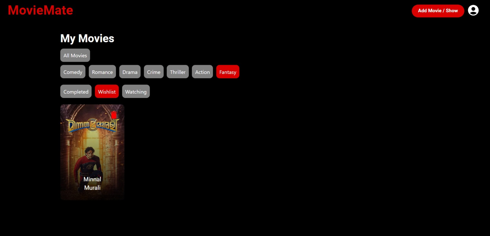

# MovieMate 🎬

**MovieMate** is a personal movie and TV show tracking app built with React (frontend) and FastAPI (backend). It uses the TMDB API to fetch trending movies and assist in autofilling data while adding your favorite titles.

---

## 🚀 Setup Instructions

### 🛠 Backend (FastAPI + SQLite)

1. Navigate to the backend folder:

   ```bash
   cd backend
   ```

2. Create and activate a virtual environment:

   ```bash
   python -m venv env
   env\Scripts\activate   # Windows
   source env/bin/activate  # macOS/Linux
   ```

3. Install dependencies:

   ```bash
   pip install -r requirements.txt
   ```

4. Start the FastAPI server:

   ```bash
   uvicorn main:app --reload
   ```

   API will run at: `http://localhost:8000`

---

### 🎨 Frontend (React + Material UI)

1. Navigate to the frontend folder:

   ```bash
   cd frontend
   ```

2. Install dependencies:

   ```bash
   npm install
   ```

3. Start the React app:

   ```bash
   npm start
   ```

   App will run at: `http://localhost:3000`

---

## 📦 Features

- 🔍 **Search with TMDB API**  
  While adding movies, automatically fetch:
  - Movie/TV name
  - Director name
  - Genre(s)
  - Platform (if available)

- 🌟 **Trending Section**  
  Homepage displays trending movies of the week from TMDB.

- 📺 **Track TV Shows**  
  You can track progress (season/episode) only for TV shows where status is `"Watching"`.

- ⭐ **Ratings and Reviews**  
  Star rating and review fields are available **only for Completed movies**.

- 🧮 **Filter and Sort Options**  
  Easily sort and filter your collection by:
  - Genre
  - Status (Completed, Watching, Wishlist)

---

## 🧰 Tech Stack

- **Frontend**: React.js, Material UI, Swiper.js
- **Backend**: FastAPI
- **Database**: SQLite
- **External API**: TMDB (The Movie Database)

---
## Screen shots
## Home Screen

## Add Movie Screen

## Movie Details Screen

## My Movies Screen

## My Movies filter 1 Screen

## My Movies filter 2 Screen

